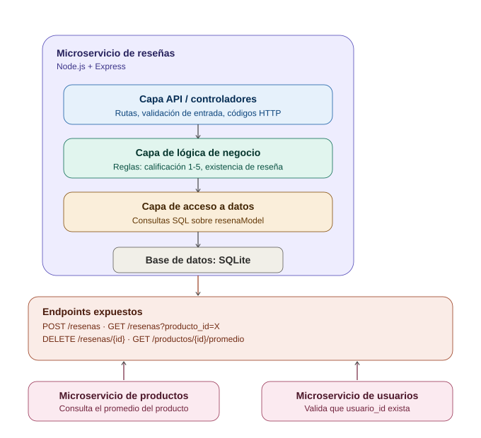

# Microservicio de reseñas

Microservicio independiente que permite a los usuarios **calificar y comentar productos**. Forma parte de un sistema mayor basado en arquitectura de microservicios, con responsabilidad única, persistencia propia y comunicación mediante API REST.

## Descripción del servicio

Este servicio administra el ciclo de vida de las reseñas de productos:

- Registrar una nueva reseña (calificación de 1 a 5 y comentario opcional).
- Consultar las reseñas asociadas a un producto.
- Eliminar una reseña.
- Calcular el promedio de calificación de un producto.

Es completamente autónomo: expone su propia API REST, define su propio modelo de datos y persiste en su propia base de datos (SQLite), sin depender de que otros microservicios estén activos.

## Diagrama de arquitectura



El servicio está organizado en tres capas internas:

- **Capa API / controladores**: recibe las peticiones HTTP, valida la entrada y traduce los resultados a códigos de estado correctos.
- **Capa de lógica de negocio**: aplica las reglas del dominio (por ejemplo, que la calificación esté entre 1 y 5, o que la reseña exista antes de eliminarla).
- **Capa de acceso a datos**: ejecuta las consultas SQL contra la base de datos propia (SQLite).

**Integración con el sistema**: el microservicio de productos consultaría este servicio para mostrar el promedio de calificación de un producto, y el microservicio de usuarios sería consultado por este servicio para validar la existencia de un `usuario_id` (integración lógica, no implementada en código en esta entrega).

## Modelo de datos

| Campo         | Tipo    | Descripción                              |
|---------------|---------|-------------------------------------------|
| id            | integer | Identificador autoincremental             |
| producto_id   | integer | Identificador del producto reseñado       |
| usuario_id    | integer | Identificador del usuario que reseña      |
| calificacion  | integer | Calificación entre 1 y 5                  |
| comentario    | string  | Comentario opcional                       |
| fecha         | string  | Fecha y hora de creación (ISO 8601)       |

## Endpoints

### `POST /resenas`
Crea una nueva reseña.

**Request:**
```json
{
  "producto_id": 101,
  "usuario_id": 5,
  "calificacion": 5,
  "comentario": "Excelente producto"
}
```

**Response `201 Created`:**
```json
{
  "id": 1,
  "producto_id": 101,
  "usuario_id": 5,
  "calificacion": 5,
  "comentario": "Excelente producto",
  "fecha": "2026-08-18T23:24:49.669Z"
}
```

**Errores:** `400` si faltan campos obligatorios, los tipos son inválidos, o la calificación está fuera del rango 1-5.

### `GET /resenas?producto_id=X`
Lista las reseñas de un producto.

**Response `200 OK`:**
```json
[
  { "id": 2, "producto_id": 101, "usuario_id": 7, "calificacion": 3, "comentario": "Cumple lo esperado", "fecha": "2026-08-18T23:24:49.678Z" },
  { "id": 1, "producto_id": 101, "usuario_id": 5, "calificacion": 5, "comentario": "Excelente producto", "fecha": "2026-08-18T23:24:49.669Z" }
]
```

**Errores:** `400` si `producto_id` no se envía o no es un número entero.

### `DELETE /resenas/{id}`
Elimina una reseña por su id.

**Response `200 OK`:**
```json
{ "mensaje": "Reseña 1 eliminada correctamente" }
```

**Errores:** `404` si la reseña no existe.

### `GET /productos/{id}/promedio`
Calcula el promedio de calificación de un producto.

**Response `200 OK`:**
```json
{ "producto_id": 101, "total_resenas": 2, "promedio": 4 }
```

**Errores:** `404` si el producto no tiene reseñas registradas.

## Tecnologías utilizadas

- **Node.js** + **Express** — servidor HTTP y enrutamiento.
- **SQLite** (`sqlite3`) — base de datos propia del servicio, embebida (sin servidor externo).
- **Postman** — colección de pruebas incluida en `postman_collection.json`.

## Instalación y ejecución local

```bash
# 1. Clonar el repositorio
git clone <URL_DEL_REPOSITORIO>
cd microservicio-resenas

# 2. Instalar dependencias
npm install

# 3. Ejecutar el servicio
npm start
```

El servicio quedará disponible en `http://localhost:3000`. La base de datos SQLite (`resenas.db`) se crea automáticamente en la raíz del proyecto la primera vez que se ejecuta.

Para probar los endpoints, importa `postman_collection.json` en Postman/Insomnia, o revisa `evidencia-pruebas.md` para ver ejemplos con `curl`.

## Estructura del proyecto

```
microservicio-resenas/
├── src/
│   ├── config/
│   │   └── database.js        # Conexión y creación de tabla SQLite
│   ├── models/
│   │   └── resenaModel.js     # Capa de acceso a datos
│   ├── controllers/
│   │   └── resenaController.js# Capa de lógica de negocio y validaciones
│   ├── routes/
│   │   └── resenaRoutes.js    # Definición de rutas REST
│   ├── app.js                 # Configuración de Express
│   └── server.js              # Punto de entrada
├── docs/
│   └── arquitectura.svg       # Diagrama de arquitectura
├── postman_collection.json    # Colección de pruebas
├── evidencia-pruebas.md       # Evidencia de funcionamiento de cada endpoint
├── package.json
├── .gitignore
└── README.md
```
